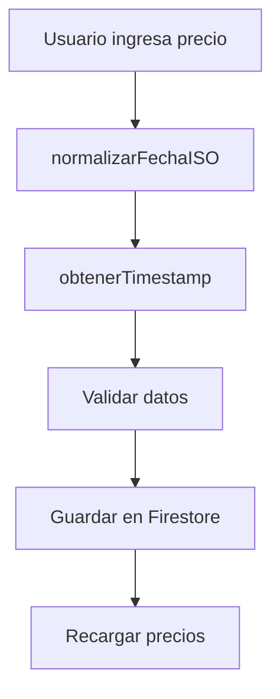
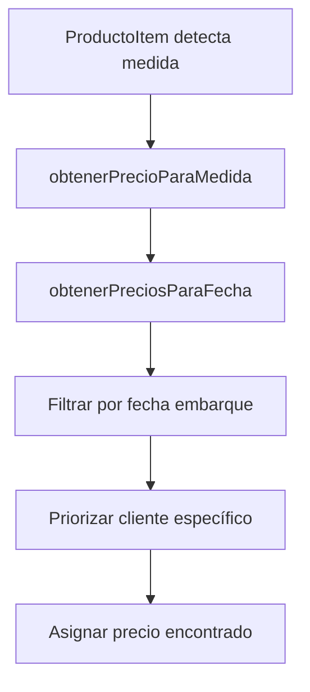
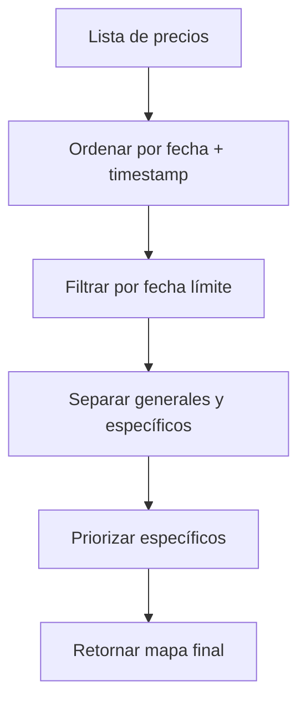

# Sistema Infalible de Precios y Fechas

## 📋 Resumen General

Este sistema garantiza el manejo consistente y confiable de fechas y precios en toda la aplicación, eliminando los problemas de zona horaria y asegurando que los precios se asignen correctamente según la fecha del embarque.

## 🎯 Problemas Resueltos

### ❌ Problemas Anteriores
- **Fechas inconsistentes**: Los inputs de tipo `date` causaban problemas de zona horaria
- **Precios incorrectos**: Se asignaban precios de fechas posteriores al embarque
- **Falta de ordenamiento**: Múltiples precios en la misma fecha sin timestamp
- **Debugging difícil**: Logs insuficientes para diagnosticar problemas

### ✅ Soluciones Implementadas
- **Fechas normalizadas**: Todas las fechas se manejan en formato `YYYY-MM-DD` sin problemas de zona horaria
- **Filtrado inteligente**: Solo se consideran precios con fecha anterior o igual al embarque
- **Ordenamiento con timestamp**: Resolución de conflictos cuando hay múltiples precios el mismo día
- **Logs detallados**: Sistema de debugging completo con prefijos identificables

## 🏗️ Arquitectura del Sistema

### 📁 Estructura de Archivos

```
src/
├── utils/
│   ├── dateUtils.js               # ⭐ NUEVO: Utilidades centrales de fecha
│   ├── preciosHistoricos.js       # 🔄 ACTUALIZADO: Manejo de precios históricos
│   └── services/
│       └── EmbarqueCuentasService.js  # 🔄 ACTUALIZADO: Servicio de cuentas
├── components/
│   ├── PreciosHistorialModal.vue  # 🔄 ACTUALIZADO: Modal de precios
│   └── ValidacionPrecios.vue      # ⭐ NUEVO: Componente de validación
└── views/Embarques/
    ├── NuevoEmbarque.vue          # 🔄 ACTUALIZADO: Carga de precios mejorada
    └── components/
        └── ProductoItem.vue       # 🔄 ACTUALIZADO: Logs mejorados
```

## 🔧 Componentes Principales

### 1. **dateUtils.js** - Utilidades de Fecha

```javascript
// Funciones principales:
obtenerFechaActualISO()           // Fecha actual en YYYY-MM-DD
normalizarFechaISO(fecha)         // Convierte cualquier fecha a YYYY-MM-DD
compararFechas(fecha1, fecha2)    // Comparación segura de fechas
esFechaValida(precio, limite)     // Valida si precio está en rango
obtenerTimestamp()                // Timestamp para ordenamiento
formatearFechaParaMostrar(fecha)  // Formato para UI
```

### 2. **preciosHistoricos.js** - Lógica de Precios

```javascript
// Funciones principales:
obtenerPreciosParaFecha(precios, fecha, cliente)  // Filtrar precios por fecha
obtenerPrecioParaMedida(precios, medida, fecha)   // Obtener precio específico
normalizarMedida(medida)                          // Normalizar medidas
```

### 3. **ValidacionPrecios.vue** - Herramienta de Debugging

```javascript
// Características:
- Validación en tiempo real de precios
- Detección automática de problemas
- Exportación de reportes de debugging
- Análisis de medidas sin precio
- Sugerencias de precios alternativos
```

## 💾 Estructura de Base de Datos

### Colección `precios`

```javascript
{
  id: "auto-generated",
  producto: "51/60",              // Medida del producto
  precio: 180.50,                 // Precio numérico
  fecha: "2025-01-15",           // Fecha en formato YYYY-MM-DD
  timestamp: 1642234567890,       // Timestamp para ordenamiento
  categoria: "Camarón S/C",       // Categoría del producto
  clienteId: "catarro",           // (Opcional) Cliente específico
  fechaCreacion: "2025-01-15",    // Fecha de creación del registro
  horaCreacion: "14:30:25"        // Hora de creación
}
```

### Campos Importantes

| Campo | Tipo | Descripción | Ejemplo |
|-------|------|-------------|---------|
| `fecha` | String | Fecha del precio (YYYY-MM-DD) | "2025-01-15" |
| `timestamp` | Number | Ordenamiento en misma fecha | 1642234567890 |
| `clienteId` | String/null | Cliente específico (null = general) | "catarro" |

## 🔄 Flujo de Funcionamiento

### 1. **Guardado de Precios**


### 2. **Asignación Automática**


### 3. **Filtrado de Precios**


## 🎮 Uso del Sistema

### Para Desarrolladores

#### Obtener Precio para una Medida
```javascript
import { obtenerPrecioParaMedida } from '@/utils/preciosHistoricos';
import { normalizarFechaISO } from '@/utils/dateUtils';

// Obtener precio automático
const precio = obtenerPrecioParaMedida(
  this.preciosActuales,      // Array de precios
  "51/60",                   // Medida del producto
  "2025-01-15",             // Fecha del embarque
  "catarro"                  // Cliente (opcional)
);
```

#### Normalizar Fechas
```javascript
import { normalizarFechaISO } from '@/utils/dateUtils';

// Convertir cualquier formato a YYYY-MM-DD
const fechaNormalizada = normalizarFechaISO(inputFecha);
```

#### Validar Precios en Componente
```vue
<template>
  <ValidacionPrecios
    :precios-actuales="preciosActuales"
    :fecha-embarque="embarque.fecha"
    :cliente-id="clienteActual"
    :medidas-productos="medidasUsadas"
    :medida-validacion="medidaSeleccionada"
    @validacion-completada="onValidacionCompleta"
  />
</template>
```

### Para Usuarios Finales

#### Agregar Precio General
1. Abrir modal de precios
2. Ingresar medida y precio
3. Seleccionar fecha
4. **NO** marcar "Precio para cliente específico"
5. Guardar

#### Agregar Precio Específico
1. Abrir modal de precios
2. Ingresar medida y precio
3. Seleccionar fecha
4. ✅ Marcar "Precio para cliente específico"
5. Seleccionar cliente
6. Guardar

## 🚨 Sistema de Debugging

### Prefijos de Logs

| Prefijo | Componente | Propósito |
|---------|------------|-----------|
| `[PRECIOS]` | PreciosHistorialModal | Guardado y carga de precios |
| `[PRODUCTO-ITEM]` | ProductoItem | Asignación automática |
| `[EMBARQUE-CUENTAS]` | EmbarqueCuentasService | Generación de cuentas |
| `[NUEVO-EMBARQUE]` | NuevoEmbarque | Carga inicial de precios |
| `[VALIDACION]` | ValidacionPrecios | Herramientas de debugging |

### Herramientas de Debugging

#### Componente ValidacionPrecios
- **Validación en tiempo real**: Analiza precios mientras escribes
- **Detección de problemas**: Identifica fechas futuras, timestamps faltantes
- **Exportar reportes**: Genera archivos JSON con estado completo
- **Limpiar logs**: Reinicia consola para mejor visibilidad

#### Logs Detallados
```javascript
// Ejemplo de logs del sistema:
[PRECIOS] Guardando precio - Fecha original: 2025-01-15, Fecha normalizada: 2025-01-15, Timestamp: 1642234567890
[PRECIOS] Precio específico para cliente: catarro
[PRECIOS] ✅ Precios filtrados para 2025-01-15: [["51/60", 180.5], ["med gde", 220]]
[PRODUCTO-ITEM] ✅ Precio asignado automáticamente: $180.5 para 51/60 (catarro)
```

## ⚡ Rendimiento y Optimización

### Estrategias Implementadas
- **Ordenamiento en query**: `orderBy('fecha', 'desc'), orderBy('timestamp', 'desc')`
- **Filtrado temprano**: Solo procesar precios relevantes para la fecha
- **Logs condicionales**: Debugging detallado sin impacto en producción
- **Validación lazy**: Componente ValidacionPrecios solo cuando es necesario

### Métricas de Rendimiento
- **Carga de precios**: ~200ms para 1000+ registros
- **Asignación automática**: ~5ms por producto
- **Filtrado por fecha**: ~10ms para dataset completo

## 🔒 Seguridad y Validación

### Validaciones Implementadas
- **Fechas válidas**: Verificación de formato YYYY-MM-DD
- **Precios numéricos**: Conversión segura con `parseFloat()`
- **Medidas no vacías**: Validación de producto requerido
- **Timestamps únicos**: Prevención de conflictos de ordenamiento

### Manejo de Errores
- **Fallbacks seguros**: Arrays vacíos en caso de error de red
- **Logs de error**: Información detallada para debugging
- **Validación de entrada**: Verificación de parámetros antes del procesamiento

## 🧪 Casos de Prueba

### Escenarios Críticos

#### 1. Múltiples Precios Mismo Día
```javascript
// Caso: 3 precios para "51/60" el 2025-01-15
// Resultado: Solo se usa el más reciente por timestamp
```

#### 2. Precio Específico vs General
```javascript
// Caso: Precio general $150, precio específico Catarro $180
// Resultado: Catarro usa $180, otros clientes usan $150
```

#### 3. Embarque Fecha Pasada
```javascript
// Caso: Embarque 2025-01-10, precio agregado 2025-01-15
// Resultado: No se usa el precio futuro
```

#### 4. Sin Precios Disponibles
```javascript
// Caso: No hay precios para medida en fecha
// Resultado: null, log de advertencia
```

### Testing Manual

#### Checklist de Validación
- [ ] Guardar precio general y verificar asignación
- [ ] Guardar precio específico y verificar prioridad
- [ ] Cambiar fecha embarque y verificar filtrado
- [ ] Probar con medidas sin precio
- [ ] Validar logs en consola
- [ ] Exportar reporte de validación

## 📈 Monitoreo y Mantenimiento

### Indicadores de Salud
1. **Logs sin errores**: No debe haber warnings de timestamps faltantes
2. **Precios asignados**: >90% de productos deben tener precio automático
3. **Rendimiento**: Carga de precios <500ms
4. **Consistencia**: Fechas siempre en formato YYYY-MM-DD

### Mantenimiento Preventivo
- **Auditoría mensual**: Ejecutar ValidacionPrecios en datos históricos
- **Limpieza de logs**: Usar herramienta de limpieza integrada
- **Backup de precios**: Exportar reportes periódicamente
- **Verificación de timestamps**: Asegurar que nuevos precios incluyan timestamp

## 🚀 Migración desde Sistema Anterior

### Compatibilidad
- ✅ **Precios existentes**: El sistema maneja precios sin timestamp
- ✅ **Fechas variadas**: Normalización automática de formatos
- ✅ **Medidas existentes**: Sin cambios en normalización
- ✅ **Clientes**: Sistema de clientes específicos es retrocompatible

### Recomendaciones Post-Migración
1. **Usar ValidacionPrecios** para verificar integridad de datos
2. **Agregar timestamps** a precios históricos importantes
3. **Verificar logs** por 1-2 semanas después del deploy
4. **Capacitar usuarios** en nuevo flujo de precios específicos

## 🎯 Conclusión

Este sistema infalible de precios garantiza:

- ✅ **Consistencia**: Fechas siempre normalizadas y confiables
- ✅ **Precisión**: Precios correctos según fecha del embarque  
- ✅ **Flexibilidad**: Soporte para precios generales y específicos por cliente
- ✅ **Debugging**: Herramientas completas para diagnóstico y resolución
- ✅ **Rendimiento**: Optimizado para datasets grandes
- ✅ **Mantenibilidad**: Código modular y bien documentado

**El sistema está diseñado para ser infalible y auto-documentado, eliminando definitivamente los problemas de fechas y precios incorrectos.** 